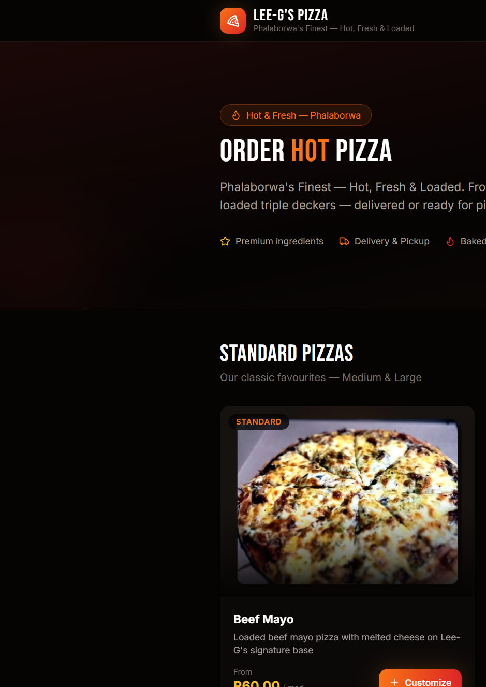
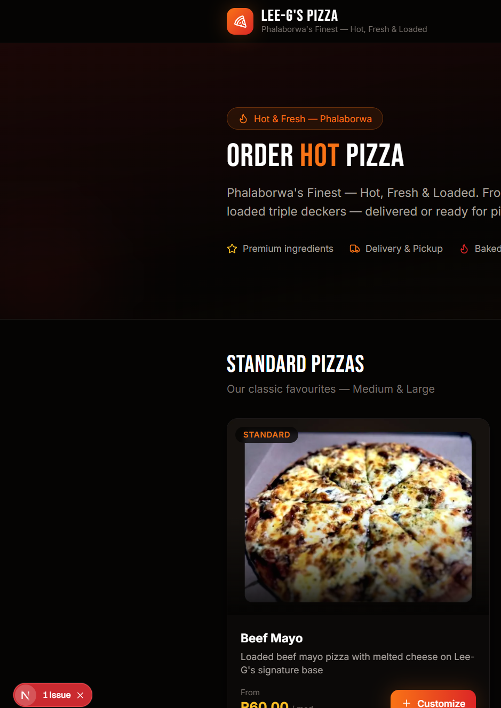
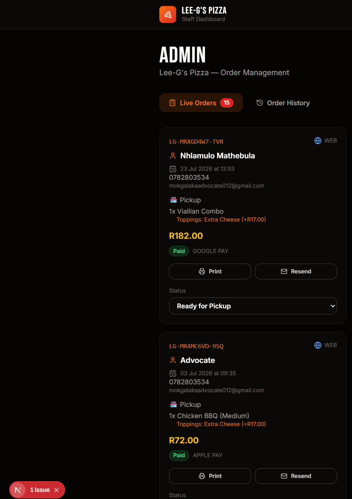

# Lee-G's Pizza — Full-Stack Ordering Platform

[](https://nextjs.org/)
[](https://react.dev/)
[](https://www.typescriptlang.org/)
[](https://www.prisma.io/)
[](LICENSE)

A production-style pizza ordering web app built for **Lee-G's Pizza** (Phalaborwa, South Africa). Designed as a portfolio project demonstrating modern full-stack development: Next.js, React, Prisma, AI integration, admin tooling, and transactional email.

## Screenshots

| Menu & ordering | AI Pizza Chef | Admin dashboard |
|---|---|---|
|  |  |  |

## Highlights for recruiters

- **Next.js 15 App Router** with TypeScript, React 19, and Tailwind CSS
- **Prisma + SQLite** menu catalog, orders, and seed data
- **AI Pizza Chef** — RAG-backed chatbot with tool calling (OpenAI; mock mode without keys)
- **Admin dashboard** — live orders, status updates, filters, printable receipts
- **Email flow** — order confirmations and status updates via Resend
- **Cart & checkout** — customization modal, sticky cart, delivery/pickup, payment UI
- **Responsive UI** — dark premium theme, menu imagery, WhatsApp contact integration

## Tech stack

| Layer | Technologies |
|-------|----------------|
| Frontend | Next.js 15, React 19, Tailwind CSS, Lucide icons |
| Backend | Next.js API routes, Prisma ORM |
| Database | SQLite (local dev) |
| AI | OpenAI Responses/Completions API, embeddings, intent routing |
| Email | Resend |
| Auth | HMAC session cookie for admin |

## Quick start

```bash
npm install
cp .env.example .env
npm run db:setup
npm run dev
```

Open [http://localhost:3000](http://localhost:3000)

Admin: `/admin` (password from `ADMIN_PASSWORD` in `.env`)

## Environment variables


| Variable | Required | Description |
|----------|----------|-------------|
| `DATABASE_URL` | Yes | SQLite path (default: `file:./dev.db`) |
| `ADMIN_PASSWORD` | Yes | Staff login for `/admin` |
| `OPENAI_API_KEY` | No | Enables full AI chat (mock mode if empty) |
| `RESEND_API_KEY` | No | Order confirmation emails |
| `RESEND_FROM_EMAIL` | No | Sender address for Resend |
| `NEXT_PUBLIC_APP_URL` | No | Public URL for links in emails |
| `NEXT_PUBLIC_WHATSAPP_NUMBER` | No | WhatsApp contact (digits only) |


## Features

- Menu with categories: standard pizzas, triple deckers, combos, sides
- 3-step pizza customization (size/crust → toppings → review)
- Floating AI chat widget with readable formatted replies
- Checkout with customer details and payment method selection
- Order tracking page
- Admin: pending/completed filters, payment visibility, resend email

## Project structure

```
src/
├── app/              # Pages & API routes
├── components/       # UI components (menu, cart, chat, admin)
└── lib/
    ├── ai/           # Chat service, RAG, tools, recommendations
    ├── prisma.ts
    ├── cart-context.tsx
    └── email.ts
prisma/
├── schema.prisma
└── seed.ts           # Full Lee-G's menu
public/images/menu/   # Product images
docs/screenshots/     # README screenshots
```

## Scripts

| Command | Description |
|---------|-------------|
| `npm run dev` | Development server |
| `npm run build` | Production build |
| `npm run db:setup` | Migrate + seed database |
| `npm run db:seed` | Re-seed menu data |

## AI chatbot

Works without API keys in **mock mode** (menu search, recommendations, basic cart commands). With `OPENAI_API_KEY`, uses GPT with function calling and retrieval from the live menu database.

## License

Portfolio / demonstration project. Menu and branding belong to Lee-G's Pizza.

## Contact (store)

**Lee-G's Pizza**  
📞 +27 71 745 1135  
📍 Big Ben's Shop, Ga-Selwane Mokhoanana, Phalaborwa
